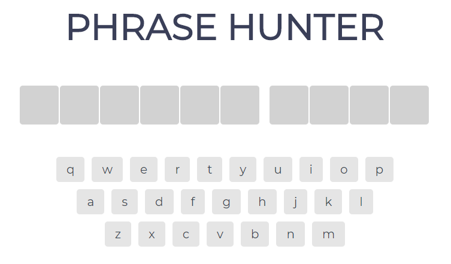

# Phrase Hunter

## Summary

Phrase hunter is a phrase guessing game, built using object oriented JavaScript - implementing the class syntax. The idea of the game is for the player to guess all of the hidden letters of a randomly picked phrase, without losing all of their lives (five lives in total). If the phrase is revealed the player wins. If the phrase is not revealed before the player loses all of their lives the game is lost. 

## UX
 The user experience for this app was created around the idea of a game being "simple and fun." For this reason the UI should be minimalistic and intuitive. This is achieved by using obvious on screen cues. The title Phrase hunter followed by empty blocks, followed by an on screen keyboard, below whichare a number of hearts indicating lives/attempts.

 The user is able toseemlessly switch between the on screen keyboard and their operating system's physical keyboard. 

 As the user progresses through the game they are provided immediate on screen feedback as to whether they are closer to winning or losing the game.

## Features

* Virtual (on screen) keyboard interaction.
* Physical keyboard interaction.
* Custom game over screen 
* Lives (attempts) indicated by hearts

## Deployment

### Github pages
The App has been deployed to github pages and can be viewed at the following link: [Phrase Hunter](https://kevincurtisdev.github.io/oop-game-show-app/)

### Localhost

To view the source files and play around with the game on your localhst environment, clone the repo using the following git command: git clone https://github.com/KevinCurtisDev/oop-game-show-app.git

Once you have cloned the repo, if you're using Visual studio and have live server installed, open up the index.html file, right click anywhere in the file and select open with live server from the menu.

Alternatively, if you have python3 installed on your os, from the command line/terminal cd into the root directory of the application. Then run the following coammand: python3 -m httpserver

Youcan visit the running application on the localhost port spun up by the python httpserver.